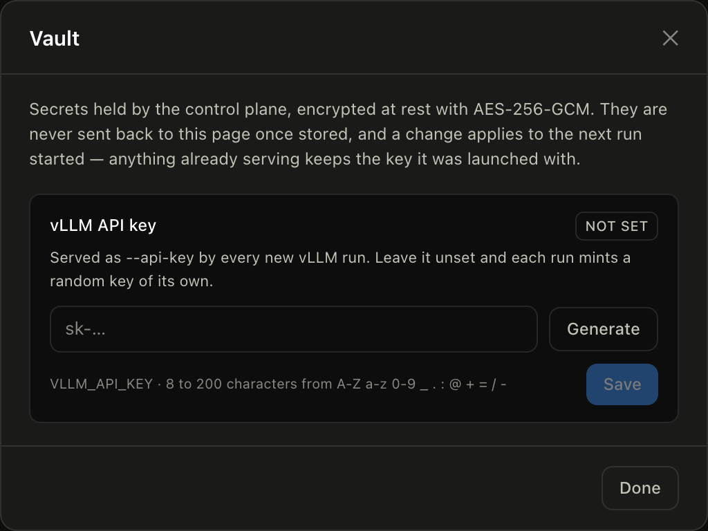
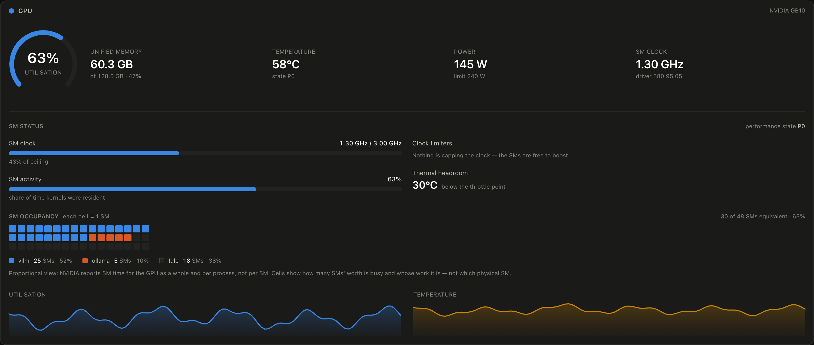
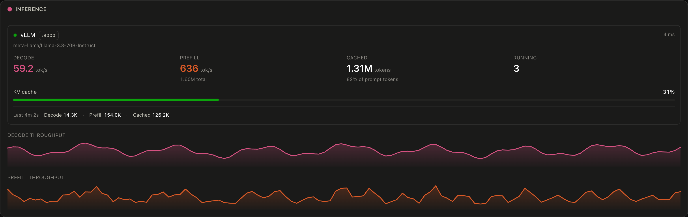
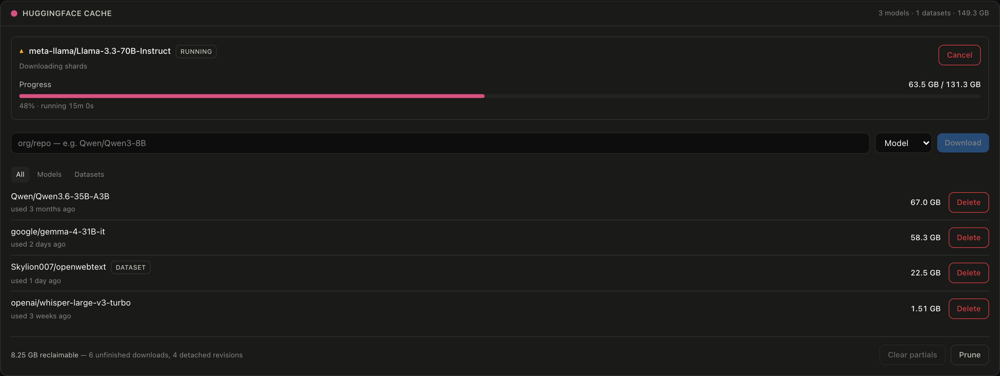
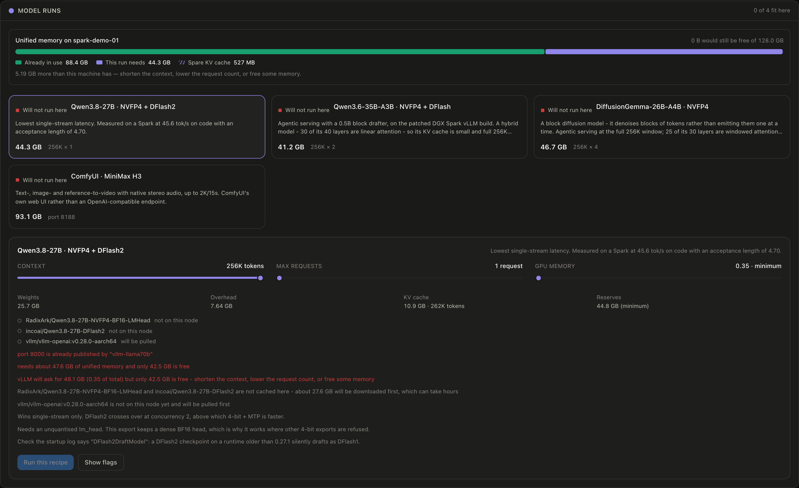
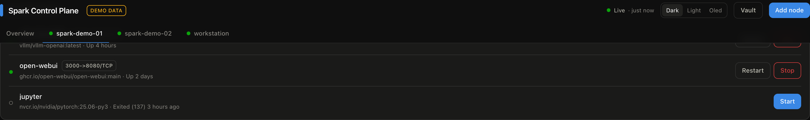

# Spark Control Plane

A web dashboard for watching one or more NVIDIA DGX Spark (GB10) boxes from a single browser tab — GPU, unified memory, CPU, storage, network, thermals, and the throughput of whatever inference server you're running on them. It works just as well against any Linux machine with an NVIDIA GPU.

Nodes are added and edited from the UI. There's no config file to hand-write and no restart after a change.


## What it shows

Each node gets a summary card on the Overview tab and a full page of its own:

- **GPU** — utilisation, memory, temperature, power draw, SM clock, and the processes holding VRAM
- **SM status** — how much of the SM clock ceiling is in use, what is capping it, and how much thermal headroom is left
- **Unified memory** — on GB10 the CPU and GPU share one LPDDR5X pool, and the UI labels it as such instead of pretending there's separate VRAM
- **CPU** — aggregate and per-core utilisation, load averages
- **Storage and network** — per-mount capacity, per-interface throughput
- **Inference** — auto-detects vLLM, llama.cpp, SGLang, TGI, and Ollama, then tracks decode and prefill throughput, cached prompt tokens, queue depth, KV cache usage, and what the server actually served over the last ten minutes
- **Containers** — every Docker container on the node, with start, stop, and restart buttons
- **Model runs** — pick a serving recipe, tune its context and concurrency against the node's free memory, then let the dashboard fetch the weights, get the image, start the container and wait for it to serve
- **HuggingFace cache** — cached models and datasets with sizes, plus download, delete, and space reclaim
- **Thermals** — every thermal zone the kernel exposes

Metrics stream over a WebSocket. History is kept on the server, so a browser refresh or a second viewer sees the same continuous chart rather than starting from an empty one.

## Requirements

- Node.js 20 or newer (or Docker)
- SSH access to each machine you want to monitor
- `nvidia-smi` on those machines — everything else comes from `/proc` and `/sys`

You don't need to install an agent on the monitored machines. The server runs ordinary read-only commands over SSH.

## Try it without any hardware

Demo mode serves synthetic metrics for three fake nodes, which is enough to see the whole UI:

```bash
npm install
DEMO_MODE=1 npm run dev
```

Open <http://localhost:5173>. You should see three nodes with moving charts and a `DEMO DATA` badge in the header.

Every screenshot in this README comes from demo mode, which is why the nodes are named `spark-demo-01` and friends.

## Run it for real

```bash
npm install
npm run build
npm start
```

The server listens on <http://127.0.0.1:5555>. Open it and click **Add node**.

For a node you reach over SSH, fill in the host, the SSH user, and either a private key path or a password. Click **Test** before saving — it reports whether the connection works, whether `nvidia-smi` found a GPU, and whether each inference port answered. Fixing a wrong key path here is much easier than debugging a node that silently never comes online.

To monitor the machine the dashboard itself runs on, choose **This machine** as the connection type. No credentials needed.

### Reaching it from other machines

By default the server binds to loopback, so only the machine running it can connect. To open it to your LAN:

```bash
BIND_HOST=0.0.0.0 npm start
```

> **Warning**: the API has no authentication. It assumes a trusted network, exactly like the SSH keys it uses. Don't expose it to the internet — put it behind Tailscale, a VPN, or an authenticating reverse proxy.

## Run it with Docker

The DGX Spark is arm64, so build on the Spark itself or pass `--platform linux/arm64`.

```bash
docker compose up --build -d
```

This mounts `./config` for the node list and `~/.ssh` (read-only) for your keys. Edit the `ports` line in `docker-compose.yml` from `127.0.0.1:5555:5555` to `5555:5555` when you want LAN access.

One caveat if you add a node with connection type **This machine**: a container can't see the host's real `/proc`, `/sys`, or GPU. Either monitor the host over SSH like any other node, or run the container with `--pid=host --privileged` and set `HOST_NSENTER=1` so commands re-enter the host namespace.

## Configuration

Every setting is an environment variable, and every one is optional. `.env.example` lists them all; these are the ones worth knowing:

| Variable | Default | What it does |
|---|---|---|
| `PORT` | `5555` | HTTP port |
| `BIND_HOST` | `127.0.0.1` | Set to `0.0.0.0` for LAN access |
| `POLL_INTERVAL_MS` | `2000` | How often each node is polled |
| `HISTORY_LENGTH` | `300` | Samples kept per metric (300 × 2s = 10 minutes of chart) |
| `OFFLINE_THRESHOLD` | `3` | Failed polls before a node is shown as offline |
| `SECRET_KEY` | generated | Encrypts stored SSH passwords |
| `HF_CACHE_INTERVAL_MS` | `30000` | How often the HuggingFace cache is re-listed |
| `RECIPES_FILE` | `./recipes.yaml` | The run planner's recipe catalogue |
| `DEMO_MODE` | off | Serve synthetic metrics |

Runtime state lives in `config/`: `nodes.json` holds the node list, `nodes-secrets.json` holds SSH passwords encrypted with AES-256-GCM, `vault.json` holds the control plane's own secrets under the same encryption, and `.secret-key` holds the generated key when you haven't set `SECRET_KEY`. All four are gitignored.

Set `SECRET_KEY` yourself if you rebuild containers without persisting `config/`. Without it, a new key is generated and previously stored passwords and vault secrets can't be decrypted — you'd have to re-enter them.

### The vault



**Vault** in the header holds the secrets the control plane uses on your behalf, encrypted at rest like the SSH passwords. There is one entry today:

| Secret | Used for |
|---|---|
| `VLLM_API_KEY` | The `--api-key` every new vLLM run serves behind |

Set it and every recipe you launch from then on serves behind that one key, so a client configured once keeps working across runs, nodes and restarts. Leave it unset and each run mints a random `sk-…` of its own — safe, but it has to be read back off the run before anything can call the endpoint.

Values are write-only. Once stored, the server reports only that a secret is set and its last four characters; there is no endpoint that hands it back. The key a *particular* run is serving behind is still shown beside that run's URL, which is where you copy it from.

Changing or removing the key affects the next run started. A container already serving keeps the key it was launched with — the one the run panel shows against it — so editing this never invalidates something already up. A value that no longer decrypts, because `SECRET_KEY` changed, is treated as unset rather than passed to a node.

## How it works

The server polls; browsers only subscribe. Ten open tabs cost the same as one, because nothing a browser does triggers collection.

Each node runs on its own timer chain rather than a shared interval, so one slow host falls behind on its own instead of delaying the others. Collecting a snapshot needs about a dozen small reads, and issuing them separately would mean a dozen SSH round trips every two seconds. Instead they're concatenated into a single shell script whose output is split back apart on a marker line — one round trip per poll. SSH connections are multiplexed with `ControlMaster`, so that round trip reuses an existing session instead of re-handshaking.

Counters that only make sense as rates — CPU time, network bytes, LLM tokens — are stored raw and diffed against the previous poll. When a counter goes backwards, which happens when a host or a model server restarts, the rate reports zero instead of a nonsense spike.

A single failed poll doesn't mark a node offline. The last good snapshot is kept and flagged stale until failures pass `OFFLINE_THRESHOLD`, which stops the UI flickering on a transient SSH hiccup.

```
browser ──WebSocket /ws──> Monitor ──> NodeMonitor (one per node)
        ──REST /api/────> Registry           │
                                             ├─ SSH or local runner ─> /proc, /sys, nvidia-smi, docker ps
                                             └─ HTTP probe ──────────> inference server /metrics
```

## What "SM status" can and can't tell you



There is **no per-SM telemetry available**. Neither NVML nor DCGM exposes individual streaming multiprocessors — `utilization.gpu` is the fraction of time at least one kernel was resident, averaged across the whole GPU. Per-SM counters exist only under a profiler (Nsight Compute / CUPTI `sm__*` metrics), which attaches to a single process, serialises kernels and adds heavy overhead. That is a profiling workflow, not something a dashboard can poll.

So the **SM occupancy grid is a proportional view, not a hardware map**. It draws one cell per physical SM (48 on a GB10, read from the CUDA driver API) and fills as many as the current utilisation accounts for, coloured by which process owns the SM time. A lit cell means "one SM's worth of the machine is busy with this process" — it does not mean that particular SM is running. The panel says so on screen, because a grid that looked like per-SM truth would be the misleading part.

What *is* knowable is why the SMs are running at the speed they are, which is usually the question behind "what are my SMs doing". The panel shows:

- **SM clock against its ceiling** — e.g. 2.38 GHz of a 3.00 GHz maximum, so you can see boost headroom at a glance
- **SM activity** — the residency figure above, labelled for what it actually measures
- **SM occupancy grid** — one cell per SM, filled proportionally and split by process (see above)
- **Per-process SM share** — from `nvidia-smi pmon`, joined onto the process table by pid
- **Clock limiters** — NVML's clock-event reasons decoded: power cap, thermal throttle, hardware slowdown, application clock limits. This is the part that explains a slow run.
- **Thermal headroom** — degrees left before the driver starts cutting clocks
- **Fixed-function engines** — encoder, decoder, JPEG and optical flow, shown only when one is actually working

All of it comes from the `nvidia-smi` query the poll already makes, so it costs no extra round trip.

An idle GPU parks its clocks and briefly asserts a power-cap bit while doing so. The panel says "the SMs are idle, so low clocks are expected" rather than warning about throughput you weren't using. Protective throttling — thermal or hardware slowdown — is always called out, whatever the load.

If you want deeper counters — SM occupancy, tensor-core activity, achieved memory bandwidth — those need DCGM (`DCGM_FI_PROF_*` fields), which is a separate NVIDIA package and isn't wired up here.

## Reading the inference panel



Point a node at an inference port and the panel identifies the server from its
own responses — `/v1/models` for anything OpenAI-compatible, `/api/tags` for
Ollama, `/metrics` for the Prometheus counters that name the backend. Most
servers publish cumulative counters rather than rates, so throughput is derived
by diffing them between polls, the same way network rates are.

**Decode and prefill get separate charts**, not two lines on one. They share a
unit and a time axis but nothing else: decode runs continuously at tens of
tokens per second while a prefill burst is thousands wide, and on a shared
y-axis one burst flattens the decode trace onto the floor.

**Prefill and cached are shown as totals, not rates.** This is worth
understanding, because a rate is the obvious choice and the wrong one:

> Decode is continuous, so a per-poll derivative describes it well. Prefill is
> not — it arrives in bursts, thousands of tokens in a fraction of a second,
> then nothing for minutes. A derivative sampled every two seconds lands on a
> zero almost every time, and the rare poll that catches a burst dilutes it
> across the whole interval. A four-token prompt measured this way displays as
> "1.5 tok/s".

So prefill keeps its rate but carries a running total underneath, and the cached
figure is a total with its share beside it.

**Cached tokens are counted inside the prompt total**, which is why the share
matters. vLLM skips cached blocks entirely — they never enter a forward pass —
so prefill throughput includes work that was never done. On a long-running agent
workload against a warm prefix cache, 94% of prompt tokens were cache hits: the
server reported 12.99M prompt tokens of which 12.32M cost nothing.

The line at the foot of each endpoint's card is what it served over the trailing
ten minutes — the same span the charts cover. Those totals are counter
differences rather than summed rates, so they are exact, they catch a burst that
lands between two polls, and a skipped poll costs nothing. A restarted model
server rewinds its counters, which restarts the window rather than reporting a
negative total.

Not every backend reports everything. Cached tokens are vLLM-only today, and a
server with no `/metrics` endpoint still appears with its model list — the
counts and the KV meter show a dash rather than a zero, since "not reported" and
"nothing happened" are different claims.

## HuggingFace models



The node detail page lists every model and dataset in the node's HuggingFace cache, largest first, with a type filter and the total. On a Spark this is usually the biggest thing on the disk — 588 GB across 28 repos on the machine this was built against.

**Downloading.** Type a repo id (`Qwen/Qwen3-8B`), pick model or dataset, and hit Download. The download runs *detached on the node*: it survives closing the page, restarting the dashboard, and dropping the SSH connection. Progress comes back on the normal poll. Only one download runs at a time per node.

**Deleting.** Delete asks the node what the repo actually costs (`hf cache rm --dry-run`) and shows that figure — "Frees 71.9 GB across 1 revision" — before you confirm. Deleting weights is irreversible and re-downloading 70 GB takes hours, so the number comes from HuggingFace rather than being estimated.

**Reclaiming.** Two kinds of dead weight are reported separately, because `hf cache prune` only handles one of them: unfinished downloads (`.incomplete` blobs left by an interrupted pull) and detached revisions. Partials younger than an hour are never swept, and both actions are refused while a download is running.

The panel needs the `hf` CLI on the node. It hides itself entirely when `hf` isn't installed, and says so when it's installed but nobody is signed in — the usual reason a gated repo fails:

```bash
hf auth login     # on the node, for gated or private repos
```

> **Note**: `hf` is often installed in `~/.local/bin`, which a login shell adds to `PATH` but `ssh host command` does not. The collector searches the usual locations rather than assuming `PATH`, so it works without you changing anything on the node.

Sizes come from `hf` itself, which reports in decimal units (a repo `du` measures at 999,588,026 bytes is reported as `999.6M`). The dashboard displays binary units like it does for memory and disk, so a figure here can differ by a few percent from what the `hf` CLI prints.

## Model runs

The node detail page lists a set of **recipes** — whole serving configurations, not templates with blanks. Each one names its weights, its image and every vLLM flag it will serve with. Pick one that fits and press **Run this recipe**; the node then downloads the weights, pulls the image, starts the container, and waits until the served endpoint actually answers.



The catalogue ships five — four ported from a reference launcher, one built from the model's own config:

| Recipe | From | Figures |
| --- | --- | --- |
| **Qwen3.8-27B · NVFP4 + DFlash2** | `serve-qwen38-27b-vllm-tuned.sh` | Measured end to end on real hardware |
| **Qwen3.6-35B-A3B · NVFP4 + DFlash** | `serve-qwen36-35b-a3b-dflash.sh` | Weights measured on the node, KV derived from its `config.json`; the overhead figure is an estimate, and the panel labels it |
| **DiffusionGemma-26B-A4B · NVFP4** | `serve-diffusiongemma-26b-a4b.sh` | Measured, off a real startup log for this model on the node |
| **ComfyUI · MiniMax H3** | `run-comfyui-h3-spark.sh` | Measured on a GB10; a `service` recipe, so no KV cache and nothing to tune |
| **Qwen3-ASR-1.7B · BF16** | [QwenLM/Qwen3-ASR](https://github.com/QwenLM/Qwen3-ASR) | Weights measured off the Hub, KV derived from `config.json`, overhead estimated; the only recipe that *builds* its image |

Add your own by appending to the list.

**Why whole recipes and not dropdowns.** The tuning is interdependent: DFlash2 needs a target with an unquantised `lm_head`, GDN layers only work under one specific mamba cache mode, and FP8 KV needs calibration scales the NVFP4 exports ship and the FP8 export doesn't. A screen of independent dropdowns would mostly produce combinations that fail at load, several minutes into a weight load.

**Recipes live in `recipes.yaml`** at the repo root. Edit it and restart the server; set `RECIPES_FILE` to keep your own catalogue out of the tree. A recipe looks like this:

```yaml
- id: qwen38-27b-nvfp4-dflash2
  name: Qwen3.8-27B · NVFP4 + DFlash2
  summary: Lowest single-stream latency; 45.6 tok/s on code, acceptance length 4.70.
  model:
    repo: RadixArk/Qwen3.8-27B-NVFP4-BF16-LMHead
    sizeGB: 23.8
    measured: true          # false means the size is an estimate, and the UI says so
  draft:                    # optional speculative drafter
    repo: incoai/Qwen3.8-27B-DFlash2
    sizeGB: 3.8
    measured: true
  image:
    ref: vllm/vllm-openai:v0.28.0-aarch64
  container: spark-run-qwen38-nvfp4-dflash2
  port: 8000
  overheadGB: 8.2           # non-torch + activation + CUDA graphs, measured
  kvBytesPerToken: 44827    # measured; sizes the pool from the settings below
  kvMeasured: true          # false labels the estimate in the panel
  args:                     # vLLM flags; a bare flag is `true`, `false` omits it
    --max-model-len: 262144 # a DEFAULT — the panel lets you change it per run
    --max-num-seqs: 1       # likewise
    --kv-cache-dtype: fp8
    --trust-remote-code: true
    --speculative-config: '{"method":"dflash","model":"incoai/Qwen3.8-27B-DFlash2","num_speculative_tokens":7}'
  notes:
    - Shown under the recipe in the panel.
```

The model id is passed positionally and served under its own name, so it isn't repeated in `args`. `--max-model-len` and `--max-num-seqs` are read back out of the flags rather than declared twice, and act as the panel's starting values. Do **not** set `--gpu-memory-utilization` — the planner computes it, and a recipe that pins it is refused on load. Values containing `{ } " :` must be quoted or YAML reads them as structure.

Every recipe is validated on load — ids, image references, container names, and every flag and value that will be interpolated into a command on the node. A bad recipe refuses the *whole* catalogue rather than being quietly dropped, and the reason appears both in the server log and in the panel itself. A broken recipe file never stops the dashboard from monitoring.

**Context and concurrency are yours to set.** Each recipe ships defaults, and the panel lets you change the context length and the maximum number of concurrent requests before you run it. The memory estimate re-prices as you do — the panel posts the settings to the server and renders what comes back, so the figure on screen is by construction the one the launch route enforces rather than a second implementation of the same arithmetic.

**`--gpu-memory-utilization` is computed, not fixed.** This is the part worth understanding, because vLLM's fraction is a policy rather than a requirement:

> vLLM claims `utilization × total` memory as one block at startup, loads the weights into it, and gives the entire remainder to the KV cache — which is never resized afterwards. Measured on a Spark running the NVFP4 + DFlash2 recipe at `0.92`: 28.16 GiB weights and non-torch, 3.07 GiB peak activation, 1.81 GiB CUDA graphs, and **80.73 GiB of KV cache** — 71% of the reservation. That bought 1,933,714 tokens of pool, or 7.38 concurrent full-length requests, at `--max-num-seqs 1`.

So the planner works out the *smallest* fraction that covers the context and concurrency you actually asked for, and passes that. The estimate bar shows both parts: a solid segment for what the settings require, and a hatched tail for whatever the fraction reserves beyond it — labelled with how many extra tokens of prefix cache that buys, since that is what the surplus becomes. In practice the same recipe that needed `0.92` (120 GB) runs at `0.37` (48 GB), which is the difference between owning the box and sharing it with whatever else is on it. You can override the fraction upward when you want a deeper prefix cache — the surplus above the minimum is exactly that — and the planner refuses an override *below* the minimum, where the pool could no longer hold one full-length request and vLLM would exit at startup.

**What "fits" means.** The blocking checks:

- **Memory** — weights + overhead + the KV cache your context and concurrency need, against the node's free memory. On a Spark that is the unified pool, since there is no separate VRAM; on a discrete GPU it is the card's own memory.
- **vLLM's own startup check** — `utilization × total` against *free*. With an automatic minimum this is unreachable; it only bites when you override upward. It is the failure the reference script's comment records: on an idle Spark with 114.97 GiB free, `0.95` asks for 115.6 GiB and the server refuses, short by 0.63 GiB.
- Free disk on the cache filesystem, a container already holding the port, a missing `hf` CLI or Docker daemon, and a run already in flight.

**The figures behind the estimate** come from `recipes.yaml`, and each is labelled measured or estimated:

- `model.sizeGB` — read off a real `hf cache ls`. vLLM logged 25.43 GiB to load a pair whose files total 25.70 GiB, so on-disk size is a good proxy for what weights cost in memory.
- `overheadGB` — non-torch + peak activation + CUDA graph capture, 7.61 GiB measured.
- `kvBytesPerToken` — 80.73 GiB over 1,933,714 tokens = 44,827 bytes. It is a property of the architecture and the KV dtype, not the weight quantisation, so every fp8-KV recipe on this model shares it. It is large because `--mamba-cache-mode align` forces the attention page to match the mamba page — vLLM logged an 880-token attention block — and hybrid layer padding wastes up to 25% on top.

**The run itself.** Like a HuggingFace download, it runs *detached on the node*: closing the page, restarting the dashboard or dropping the SSH connection doesn't touch it. Progress arrives on the normal poll as a phase — Weights, Image, Container, Loading, Serving — with a byte count during the download, which is the only phase with a total to divide by. **Cancel** kills the whole sequence and removes any container it had already started; **Stop server** takes down a finished one.

A run reaches "Serving" only after the endpoint answers a real request, not merely when the container starts. That step then stays lit for as long as the container is up, and greys out when the server is gone — the run's own exit code only says what was true when the script finished, so "is it still serving" is answered from `docker ps` on the current poll.

The key it serves behind — the vault's `VLLM_API_KEY` if one is set, otherwise the one this run minted — appears beside the URL, masked. One icon reveals it, another copies it:

```
Authorization: Bearer sk-...
```

Copy works over plain HTTP as well as HTTPS. `navigator.clipboard` needs a secure context, which a LAN address is not, so the button falls back to selecting the field and asking the browser to copy the selection — and if that is refused too, it leaves the key selected and names the keyboard shortcut. The field is a real input throughout, so selecting it by hand always works.

> **Warning**: the server is published on all interfaces, matching the reference script's default. On a trusted network that is what makes it reachable from your other machines; the API key is the only thing in front of it.

**Building images.** Recipes name a published image and pull it — building vLLM for aarch64 on the node would take hours and produce something less tested than the pinned image. A recipe that genuinely needs a derived image can declare `image.build`, and the same phase writes a Dockerfile on the node and builds it instead. The Qwen3-ASR recipe is the one that does: `vllm/vllm-openai` ships without vLLM's `audio` extra, and because the audio loaders degrade to placeholders rather than failing at import, the stock image would start, pass the readiness probe, and only fail on the first audio file. Its build adds four wheels on top of the pinned image and rebuilds nothing.

**Publishing on another port.** Each recipe declares a port because a serving configuration has a natural one — 8000 for the vLLM recipes, 8188 for ComfyUI — but the node does not have to agree, and something unrelated may already hold it. The panel's **Publish on port** field overrides the host side of the mapping; the container still listens on its own port, so nothing about the model or its flags changes. The plan is re-priced and re-checked against whatever you type, so a port already taken comes back as a blocker naming the container holding it, and clearing the field hands the port back to the recipe.

One run at a time per node: two recipes racing would fight over the same port, the same memory and possibly the same container name.

## Containers



The node detail page lists every container `docker ps -a` reports, running ones first, and gives you **Start**, **Stop**, and **Restart** on each row. Stopping asks for confirmation first.

Nothing is optimistic: after an action the server re-polls within about half a second and the row updates from real `docker ps` output. A container that fails to start never looks like it started.

The SSH user needs to reach the Docker daemon. If it can't, the panel says so rather than showing an empty list — usually it means adding the user to the `docker` group on that node:

```bash
sudo usermod -aG docker "$USER"   # then log out and back in
```

> **Warning**: control of the Docker daemon is effectively root on that machine. That's the same trust level the shutdown and reboot actions already assume, and the API is unauthenticated — another reason to keep the dashboard off untrusted networks.

Per-container CPU and memory aren't collected. `docker stats` blocks for about a second per call, which would dominate a two-second poll loop.

## Power actions

You can reboot or shut down a node from its detail page, and send a Wake-on-LAN packet if you've set its MAC address. Along with the container actions above, these are the only commands the dashboard writes rather than reads — a fixed set of verbs, no user-supplied shell text.

Shutdown and reboot need passwordless sudo for the SSH user. Without it, the dashboard tells you so rather than failing silently. On the target machine:

```bash
echo "$USER ALL=(ALL) NOPASSWD: /sbin/shutdown, /sbin/reboot" | sudo tee /etc/sudoers.d/spark-control-plane
```

Shutting down the machine hosting the dashboard is refused, since it would take the dashboard down too.

## Development

```bash
npm run dev        # Vite on :5173 proxying to the API on :5555
npm test           # parser and validation tests
npm run typecheck
```

`npm run dev` runs the API and the frontend together. Add `DEMO_MODE=1` to work without hardware.

The tests cover the parsing and validation logic — `/proc` and `nvidia-smi` output, Prometheus metrics, Wake-on-LAN packets, node validation, and the command batching. They're pure functions with fixture input, so they run in well under a second and need no hardware.

### Layout

```
recipes.yaml        the run planner's recipe catalogue
server/
  index.js          HTTP + WebSocket entry point
  monitor.js        poll loop, rate derivation, snapshots
  registry.js       node CRUD, validation, persistence
  secrets.js        AES-256-GCM password storage
  vault.js          control-plane secrets: the shared vLLM API key
  power.js          shutdown, reboot, Wake-on-LAN
  containers.js     docker start / stop / restart
  huggingface.js    model download / delete / reclaim
  recipes.js        loads recipes.yaml; the memory / disk fit arithmetic
  planner.js        run a recipe: download, image, launch, wait for ready
  collectors/       /proc + /sys, nvidia-smi, docker ps, hf cache, inference probes, demo data
  exec/             local and SSH command runners, batching
src/
  App.tsx           shell, tabs, fleet summary
  components/       node cards, detail panels, container list, model cache, run planner, add/edit and vault dialogs
  components/viz/   sparkline, line chart, dial, meter
  hooks/            WebSocket state, element sizing
```

## Things worth knowing

**Memory bandwidth isn't measurable from `nvidia-smi`.** The GB10's 273 GB/s figure is shown as a platform spec, not a live reading. Achieved bandwidth needs DCGM's profiling fields, which aren't wired up here.

**GB10 reports no discrete VRAM.** `nvidia-smi` returns `[N/A]` for `memory.total`, `memory.used` and `power.limit`, because the GPU's memory *is* the system's unified pool. The GPU panel falls back to the system memory figures rather than showing dashes.

**Inference ports are probed over plain HTTP from wherever the dashboard runs**, not through the SSH tunnel. If a model server only listens on `127.0.0.1` on the node, the dashboard can't see it. Bind it to the LAN interface, or run the dashboard on that node.

**Fields the driver doesn't report stay blank.** A dash means "not reported", never zero. Fan speed on a passively cooled GB10 is a real example.

## Credit

Inspired by [sparkDash](https://github.com/MiaAI-Lab/sparkDash), which covers similar ground for the same hardware.
