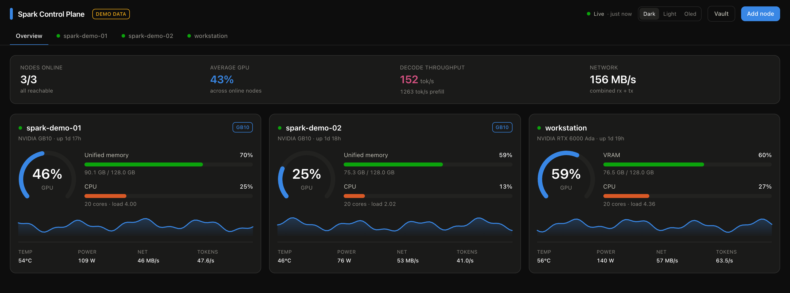

# Spark Control Plane

A web dashboard for watching one or more NVIDIA DGX Spark (GB10) boxes from a single browser tab — GPU, unified memory, CPU, storage, network, thermals, and the throughput of whatever inference server you're running on them. It works just as well against any Linux machine with an NVIDIA GPU.

Nodes are added and edited from the UI. There's no config file to hand-write and no restart after a change.



## What it shows

Each node gets a summary card on the Overview tab and a full page of its own:

- **GPU** — utilisation, memory, temperature, power draw, SM clock, and the processes holding VRAM
- **SM status** — how much of the SM clock ceiling is in use, what is capping it, and how much thermal headroom is left
- **Unified memory** — on GB10 the CPU and GPU share one LPDDR5X pool, and the UI labels it as such instead of pretending there's separate VRAM
- **CPU** — aggregate and per-core utilisation, load averages
- **Storage and network** — per-mount capacity, per-interface throughput
- **Inference** — auto-detects vLLM, llama.cpp, SGLang, TGI, and Ollama, then tracks decode/prefill tokens per second, queue depth, and KV cache usage
- **Containers** — every Docker container on the node, with start, stop, and restart buttons
- **Thermals** — every thermal zone the kernel exposes

Metrics stream over a WebSocket. History is kept on the server, so a browser refresh or a second viewer sees the same continuous chart rather than starting from an empty one.

## Requirements

- Node.js 20 or newer (or Docker)
- SSH access to each machine you want to monitor
- `nvidia-smi` on those machines — everything else comes from `/proc` and `/sys`

You don't need to install an agent on the monitored machines. The server runs ordinary read-only commands over SSH.

## Try it without any hardware

Demo mode serves synthetic metrics for three fake nodes, which is enough to see the whole UI:

```bash
npm install
DEMO_MODE=1 npm run dev
```

Open <http://localhost:5173>. You should see three nodes with moving charts and a `DEMO DATA` badge in the header.

## Run it for real

```bash
npm install
npm run build
npm start
```

The server listens on <http://127.0.0.1:5555>. Open it and click **Add node**.

For a node you reach over SSH, fill in the host, the SSH user, and either a private key path or a password. Click **Test** before saving — it reports whether the connection works, whether `nvidia-smi` found a GPU, and whether each inference port answered. Fixing a wrong key path here is much easier than debugging a node that silently never comes online.

To monitor the machine the dashboard itself runs on, choose **This machine** as the connection type. No credentials needed.

### Reaching it from other machines

By default the server binds to loopback, so only the machine running it can connect. To open it to your LAN:

```bash
BIND_HOST=0.0.0.0 npm start
```

> **Warning**: the API has no authentication. It assumes a trusted network, exactly like the SSH keys it uses. Don't expose it to the internet — put it behind Tailscale, a VPN, or an authenticating reverse proxy.

## Run it with Docker

The DGX Spark is arm64, so build on the Spark itself or pass `--platform linux/arm64`.

```bash
docker compose up --build -d
```

This mounts `./config` for the node list and `~/.ssh` (read-only) for your keys. Edit the `ports` line in `docker-compose.yml` from `127.0.0.1:5555:5555` to `5555:5555` when you want LAN access.

One caveat if you add a node with connection type **This machine**: a container can't see the host's real `/proc`, `/sys`, or GPU. Either monitor the host over SSH like any other node, or run the container with `--pid=host --privileged` and set `HOST_NSENTER=1` so commands re-enter the host namespace.

## Configuration

Every setting is an environment variable, and every one is optional. `.env.example` lists them all; these are the ones worth knowing:

| Variable | Default | What it does |
|---|---|---|
| `PORT` | `5555` | HTTP port |
| `BIND_HOST` | `127.0.0.1` | Set to `0.0.0.0` for LAN access |
| `POLL_INTERVAL_MS` | `2000` | How often each node is polled |
| `HISTORY_LENGTH` | `300` | Samples kept per metric (300 × 2s = 10 minutes of chart) |
| `OFFLINE_THRESHOLD` | `3` | Failed polls before a node is shown as offline |
| `SECRET_KEY` | generated | Encrypts stored SSH passwords |
| `DEMO_MODE` | off | Serve synthetic metrics |

Runtime state lives in `config/`: `nodes.json` holds the node list, `nodes-secrets.json` holds SSH passwords encrypted with AES-256-GCM, and `.secret-key` holds the generated key when you haven't set `SECRET_KEY`. All three are gitignored.

Set `SECRET_KEY` yourself if you rebuild containers without persisting `config/`. Without it, a new key is generated and previously stored passwords can't be decrypted — you'd have to re-enter them.

## How it works

The server polls; browsers only subscribe. Ten open tabs cost the same as one, because nothing a browser does triggers collection.

Each node runs on its own timer chain rather than a shared interval, so one slow host falls behind on its own instead of delaying the others. Collecting a snapshot needs about a dozen small reads, and issuing them separately would mean a dozen SSH round trips every two seconds. Instead they're concatenated into a single shell script whose output is split back apart on a marker line — one round trip per poll. SSH connections are multiplexed with `ControlMaster`, so that round trip reuses an existing session instead of re-handshaking.

Counters that only make sense as rates — CPU time, network bytes, LLM tokens — are stored raw and diffed against the previous poll. When a counter goes backwards, which happens when a host or a model server restarts, the rate reports zero instead of a nonsense spike.

A single failed poll doesn't mark a node offline. The last good snapshot is kept and flagged stale until failures pass `OFFLINE_THRESHOLD`, which stops the UI flickering on a transient SSH hiccup.

```
browser ──WebSocket /ws──> Monitor ──> NodeMonitor (one per node)
        ──REST /api/────> Registry           │
                                             ├─ SSH or local runner ─> /proc, /sys, nvidia-smi, docker ps
                                             └─ HTTP probe ──────────> inference server /metrics
```

## What "SM status" can and can't tell you

There is **no per-SM breakdown available**. Neither NVML nor DCGM exposes individual streaming multiprocessors, so a grid of SMs like the per-core CPU one cannot be built — `utilization.gpu` is the fraction of time at least one kernel was resident, averaged across the whole GPU. Anything claiming otherwise is estimating.

What *is* knowable is why the SMs are running at the speed they are, which is usually the question behind "what are my SMs doing". The panel shows:

- **SM clock against its ceiling** — e.g. 2.38 GHz of a 3.00 GHz maximum, so you can see boost headroom at a glance
- **SM activity** — the residency figure above, labelled for what it actually measures
- **Clock limiters** — NVML's clock-event reasons decoded: power cap, thermal throttle, hardware slowdown, application clock limits. This is the part that explains a slow run.
- **Thermal headroom** — degrees left before the driver starts cutting clocks
- **Fixed-function engines** — encoder, decoder, JPEG and optical flow, shown only when one is actually working

All of it comes from the `nvidia-smi` query the poll already makes, so it costs no extra round trip.

An idle GPU parks its clocks and briefly asserts a power-cap bit while doing so. The panel says "the SMs are idle, so low clocks are expected" rather than warning about throughput you weren't using. Protective throttling — thermal or hardware slowdown — is always called out, whatever the load.

If you want deeper counters — SM occupancy, tensor-core activity, achieved memory bandwidth — those need DCGM (`DCGM_FI_PROF_*` fields), which is a separate NVIDIA package and isn't wired up here.

## Containers

The node detail page lists every container `docker ps -a` reports, running ones first, and gives you **Start**, **Stop**, and **Restart** on each row. Stopping asks for confirmation first.

Nothing is optimistic: after an action the server re-polls within about half a second and the row updates from real `docker ps` output. A container that fails to start never looks like it started.

The SSH user needs to reach the Docker daemon. If it can't, the panel says so rather than showing an empty list — usually it means adding the user to the `docker` group on that node:

```bash
sudo usermod -aG docker "$USER"   # then log out and back in
```

> **Warning**: control of the Docker daemon is effectively root on that machine. That's the same trust level the shutdown and reboot actions already assume, and the API is unauthenticated — another reason to keep the dashboard off untrusted networks.

Per-container CPU and memory aren't collected. `docker stats` blocks for about a second per call, which would dominate a two-second poll loop.

## Power actions

You can reboot or shut down a node from its detail page, and send a Wake-on-LAN packet if you've set its MAC address. Along with the container actions above, these are the only commands the dashboard writes rather than reads — a fixed set of verbs, no user-supplied shell text.

Shutdown and reboot need passwordless sudo for the SSH user. Without it, the dashboard tells you so rather than failing silently. On the target machine:

```bash
echo "$USER ALL=(ALL) NOPASSWD: /sbin/shutdown, /sbin/reboot" | sudo tee /etc/sudoers.d/spark-control-plane
```

Shutting down the machine hosting the dashboard is refused, since it would take the dashboard down too.

## Development

```bash
npm run dev        # Vite on :5173 proxying to the API on :5555
npm test           # parser and validation tests
npm run typecheck
```

`npm run dev` runs the API and the frontend together. Add `DEMO_MODE=1` to work without hardware.

The tests cover the parsing and validation logic — `/proc` and `nvidia-smi` output, Prometheus metrics, Wake-on-LAN packets, node validation, and the command batching. They're pure functions with fixture input, so they run in well under a second and need no hardware.

### Layout

```
server/
  index.js          HTTP + WebSocket entry point
  monitor.js        poll loop, rate derivation, snapshots
  registry.js       node CRUD, validation, persistence
  secrets.js        AES-256-GCM password storage
  power.js          shutdown, reboot, Wake-on-LAN
  containers.js     docker start / stop / restart
  collectors/       /proc + /sys, nvidia-smi, docker ps, inference probes, demo data
  exec/             local and SSH command runners, batching
src/
  App.tsx           shell, tabs, fleet summary
  components/       node cards, detail panels, container list, add/edit dialog
  components/viz/   sparkline, line chart, dial, meter
  hooks/            WebSocket state, element sizing
```

## Things worth knowing

**Memory bandwidth isn't measurable from `nvidia-smi`.** The GB10's 273 GB/s figure is shown as a platform spec, not a live reading. Achieved bandwidth needs DCGM's profiling fields, which aren't wired up here.

**GB10 reports no discrete VRAM.** `nvidia-smi` returns `[N/A]` for `memory.total`, `memory.used` and `power.limit`, because the GPU's memory *is* the system's unified pool. The GPU panel falls back to the system memory figures rather than showing dashes.

**Inference ports are probed over plain HTTP from wherever the dashboard runs**, not through the SSH tunnel. If a model server only listens on `127.0.0.1` on the node, the dashboard can't see it. Bind it to the LAN interface, or run the dashboard on that node.

**Fields the driver doesn't report stay blank.** A dash means "not reported", never zero. Fan speed on a passively cooled GB10 is a real example.

## Credit

Inspired by [sparkDash](https://github.com/MiaAI-Lab/sparkDash), which covers similar ground for the same hardware.
